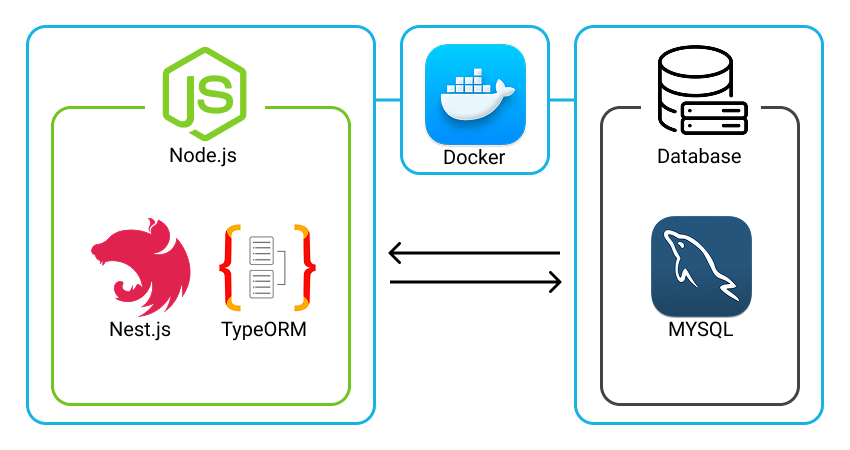
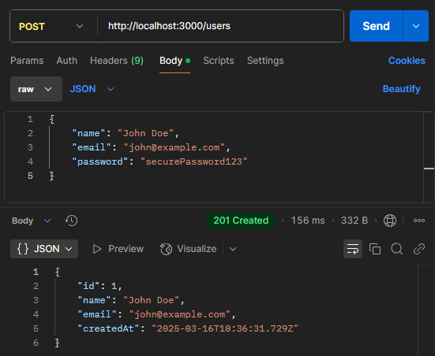
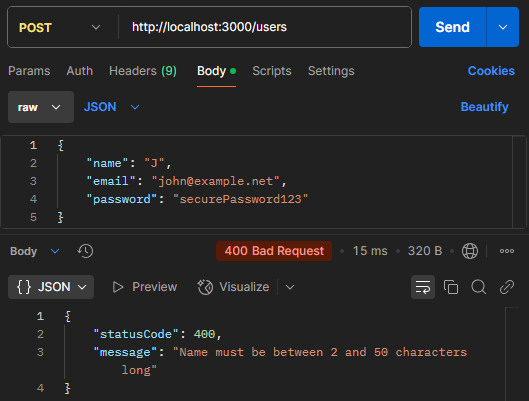
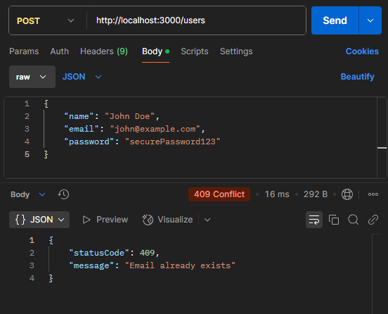

# Task1

NestJS 기반 사용자 등록 백엔드 서비스

## 기술스텍
- Docker, Node.js, NestJS, TypeORM, MySQL, bcrypt, class-validator 

## 아키텍쳐



## 테스트 및 검증 - Postman

### 201 (success)


### 400 (name invalid)


### 400 (password invalid)


### 409 (email exists)


## API

| Method | Path                                      | Headers | Path params | Query params | Body params |
|--------|-------------------------------------------|---------|-------------|--------------|-------------|
| POST   | [/users](#/users)                    | -       | -           | -            | See below   |

### /users 

**Body params**

|  Property  |   Type   | Description |
|------------|----------|-------------|
| name       | string   | 이름  <br/><br/> **minLength : 2** <br/> **maxLength : 50** |
| email      | string   | 이메일 <br/><br/> **email형식** |
| password   | string   | 비밀번호  <br/><br/> **minLength : 8** <br/> **숫자,문자 포함** <br/> **해쉬화 후 저장 (bcrypt)** |

**Request Example**
```
{
    "name": "John Doe",
    "email": "john@example.com",
    "password": "securePassword123"
}
```

**Response**
| HTTP Status Code |   Type   | Description |
|------------------|----------|-------------|
| 201              | JSON     | OK          |
| 400              | Error    | 잘못된 요청 (입력 데이터 유효하지 않음) |
| 409              | Error    | 이미 존재하는 이메일 |

**Response Example**
<br/>

**201**
```
{
    "id": 1,
    "name": "John Doe",
    "email": "john@example.com",
    "createdAt": "2025-01-21T07:33:37.696Z"
}
```

**400**
```
{
    "statusCode": 400,
    "message": "Password must be at least 8 characters long"
}
```

**409**
```
{
    "statusCode": 409,
    "message": "Email already exists"
}
```