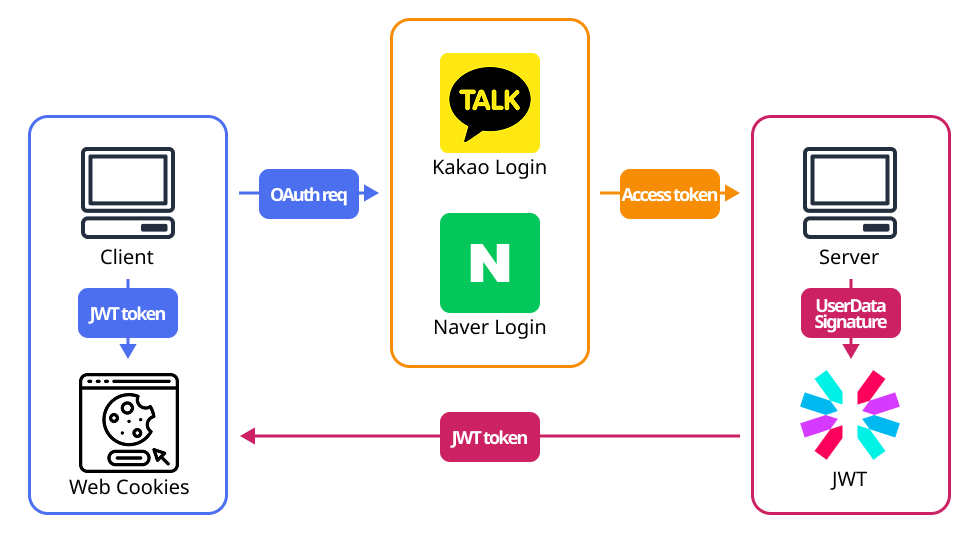
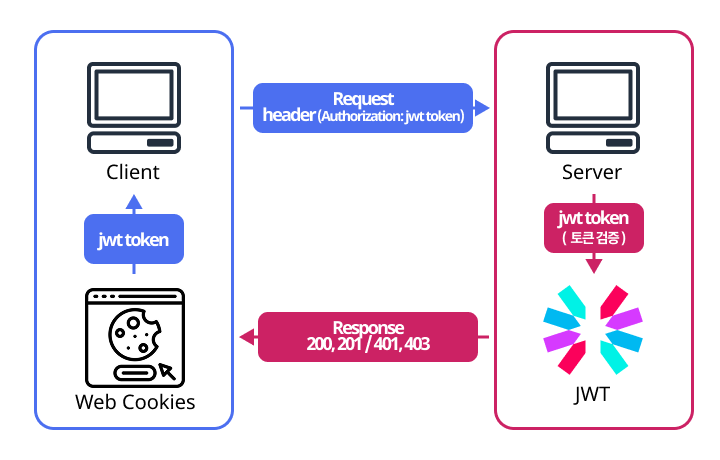

# Task3

BO 서비스 설계

## OAuth와 JWT ?

저는 OAuth와 JWT가 각각 다른 특성과 장점을 가지고 있습니다.  
이러한 이유로, 두 가지 기술을 모두 활용하여 서비스를 개발하는게 좋다고 생각합니다.

## 이유 및 장점

### OAuth ?

OAuth의 가장 큰 장점은 접근성과 신뢰성이라고 생각합니다.   
사용자에게 회원가입의 번거로움을 줄여주며,  
네이버나 카카오와 같은 신뢰할 수 있는 국내 소셜 플랫폼을 통해   
로그인 및 인증을 할 수 있게 함으로써 사용자의 신뢰를 얻을 수 있습니다.   
추가적으로 인증 프로토콜을 제3자 애플리케이션이 처리함으로써 보안성이 향상됩니다.

### JWT ?

JWT는 각 요청에 필요한 인증 정보를 포함하고 있어서,  
서버가 사용자의 상태를 저장할 필요가 없습니다.   
이로 인해 추가적인 저장소나 메모리가 필요하지 않아,  
인프라 비용을 절감할 수 있는 장점이 있습니다.

### BO 서비스에서?

BO 서비스에서 내부망을 사용한다면 당연히 OAuth는 사용할 수 없습니다.   
하지만 외부망과 혼용하는 서비스를 제공한다면 OAuth를 사용하지 않을 이유가 전혀 없습니다.  
인증 프로토콜을 외부에 맡김으로써 보안성이 향상되고, 인프라 비용도 절감할 수 있습니다.   
간편하게 필요한 정보만 가져오고, 추가로 필요한 정보를 저장함으로써   
가입 등의 절차를 간소화할 수 있습니다. 소셜 연동 기능도 적절히 추가할 수 있게 됩니다.   
 
JWT는 로그인 정보를 유지하고 권한도 포함하여, 권한별로 보장하는 정보와 기능을  
구별할 수 있게 해줍니다. 따라서 JWT는 당연히 필요한 기능입니다.

## 구현방법 - 아키텍쳐

### Sign In, Sign Up

### Request, Respone

## 구현경험

[프로젝트 링크](https://github.com/weaall/travelo.store/blob/main/server/src/services/authService.ts)

저는 개인 프로젝트에서 OAuth와 JWT를 통합한 시스템을 구현한 경험이 있습니다.  
네이버와 카카오를 이용하여 소셜 로그인을 구현했습니다.  
사용자가 처음 네이버나 카카오로 로그인할 때, OAuth 서버에서 받은 토큰을 해시화하여  
이메일과 이름과 같은 필요한 정보와 함께 제 데이터베이스에 저장했습니다.  
이후 소셜 로그인을 할 때마다 OAuth 서버에서 받은 토큰을 판단하여,  
JWT에 정보(email)과 역할(admin, customer)를 담아  
클라이언트 측에서 쿠키에 일정 시간 동안 저장하도록 했습니다. 
 
관리자 역할이 필요한 API 요청이나 고객 정보가 필요한 API 요청에서는  
헤더에 포함된 JWT를 검증하여 적절한 응답을 제공하는 시스템을 구현했습니다.  
이를 통해 OAuth를 통해 안전하게 인증하고, JWT를 통해 효율적으로 인가를  
수행하는 시스템을 성공적으로 구축할 수 있었습니다. 