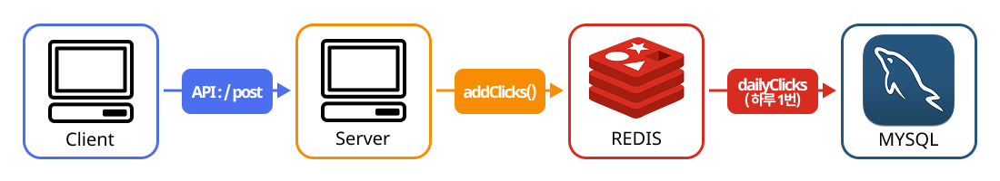
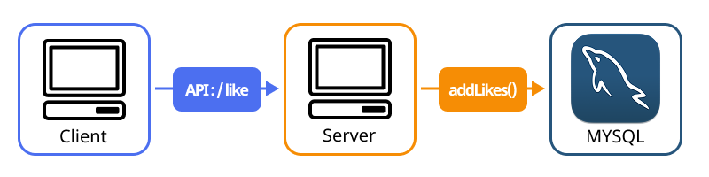

# Task4

BO 통계 서비스

## 아키택처

### 클릭


클라이언트가 포스트를 조회할 때마다 Redis에 실시간으로 조회수를 증가시키고, <br/>
24시간 동안 누적된 데이터를 매일 한 번 DB에 일일단위로 저장합니다. <br/>
 <br/>
장점 <br/>
실시간 성능 향상 (Redis), DB 부하 감소 <br/>  <br/>
단점 <br/>
데이터 손실 위험 (Redis의 비정상적 종료나 재시작시 데이터 손실) <br/> <br/>
      → RDB 스냅샷, AOF 로그 설정으로 데이터 손실 방지 <br/>

### 좋아요


클라이언트가 좋아요 요청을 보낼 때마다 해당 사용자의 ID와 포스트 ID를 DB에 저장하는 방식입니다.  <br/>
각 사용자는 특정 포스트에 대해 한 번만 좋아요를 누를 수 있으며,  <br/>
데이터베이스에 고유 제약 조건을 설정하여 중복을 방지합니다. <br/>
 <br/>
장점 <br/>
중복 클릭 및 조작 방지, 사용자 경험 개선 <br/> <br/>
단점 <br/>
DB접근 횟수 증가 (좋아요를 할때마다 DB에 접근, 데이터의 Refresh도 필요) <br/>
 <br/>
      → 좋아요시 DB에 데이트를 업데이트함과 동시에 Redis에서 상태 업데이트, 추가적인 DB호출이 불필요 <br/>
        WS나 SSE를 이용해서 다른 클라이언트에게 변경사항을 전송 <br/>

## Mysql Table

### Likes Table

| Column Name | Description | Data Type     | Constraints                                                |
|-------------|-------------|---------------|------------------------------------------------------------|
| id          | PK          | INT           | AUTO_INCREMENT                                             |
| user_id     | FK          | INT           | NOT NULL, REFERENCES user(id)                              |
| post_id     | FK          | INT           | NOT NULL, REFERENCES post(id)                              |
| created_at  | -           | DATETIME      | DEFAULT CONVERT_TZ<br/>(CURRENT_TIMESTAMP, 'UTC', 'Asia/Seoul') |
| UNIQUE      | -           | -             | (user_id, post_id)                                         |

### DailyClicks Table

| Column Name | Description | Data Type     | Constraints                                                |
|-------------|-------------|---------------|------------------------------------------------------------|
| id          | PK          | INT           | AUTO_INCREMENT                                             |
| post_id     | FK          | INT           | NOT NULL, REFERENCES post(id)                              |
| date        | -           | DATE          | NOT NULL                                                   |
| clicks      | -           | INT           | NOT NULL                                                   |
| UNIQUE      | -           | -             | (post_id, date)                                            |


### 스키마
```SQL
CREATE TABLE Likes (
    id INT AUTO_INCREMENT PRIMARY KEY,
    user_id INT NOT NULL,
    post_id INT NOT NULL,
    created_at DATETIME DEFAULT CONVERT_TZ(CURRENT_TIMESTAMP, 'UTC', 'Asia/Seoul'),
    UNIQUE (user_id, post_id),
    FOREIGN KEY (user_id) REFERENCES User(user_id),
    FOREIGN KEY (post_id) REFERENCES Post(post_id)
);

CREATE TABLE DailyClicks (
    id INT AUTO_INCREMENT PRIMARY KEY,
    post_id INT NOT NULL,
    date DATE NOT NULL,
    clicks INT NOT NULL,
    UNIQUE (post_id, date),
    FOREIGN KEY (post_id) REFERENCES Post(post_id)
);
```

### 인덱싱
```sql
//특정 포스트에 대한 총 좋아요 수와 좋아요를 누른 사용자를 조회
CREATE INDEX idx_post_id ON Likes(post_id);
CREATE INDEX idx_post_id_user_id ON Likes(post_id, user_id);

//특정 사용자가 좋아요를한 포스트 조회
CREATE INDEX idx_user_id ON Likes(user_id);
CREATE INDEX idx_user_id_post_id ON Likes(user_id, post_id);

//특정 포스트의 일일 클릭 수와 총 클릭 수를 조회
CREATE INDEX idx_post_id_date ON DailyClicks(post_id, date);
CREATE INDEX idx_post_id_clicks ON DailyClicks(post_id, clicks);
```

## 클릭 수 조작 방지 (클라이언트)

### 쿠키 및 로컬 스토리지 
사용자가 포스트를 조회할 때, 쿠키나 로컬 스토리지에 해당 정보를 저장하고, <br/>
일정 시간 내에 동일한 포스트에 대한 추가 조회를 무시합니다. <br/>

### 디바운싱
포스트 클릭 이후 일정 시간 내에 추가적인 클릭의 발생을 무시합니다. <br/>

### 웹 보안 솔루션 (Cloudflare, CAPTCHA) 
비정상적인 조회 패턴이 감지시 악의적인 봇 트래픽이나, 공격을 방지합니다. <br/>

## 클릭 수 조작 방지 (서버)

### 세션 및 사용자 ID 기반 제한 
동일한 사용자의 ID로 짧은 시간 동안 비정상적으로 많은 클릭 요청이 발생하면 <br/>
이를 무시하거나 응답하지 않게 설정합니다.

### IP 주소 기반 제한 
동일한 사용자의 IP로 짧은 시간 동안 비정상적으로 많은 클릭 요청이 발생하면 <br/>
이를 무시하거나 응답하지 않게 설정합니다.

### 로그 및 모니터링
클릭 이벤트를 로그에 기록, 특정 사용자가 비정상적으로 많은 클릭을 생성하는 경우  <br/>
이를 감지하여 차단합니다.